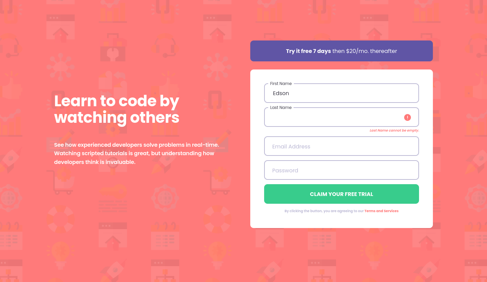

# Frontend Mentor - Intro component with sign up form solution

This is a solution to the [Intro component with sign up form challenge on Frontend Mentor](https://www.frontendmentor.io/challenges/intro-component-with-signup-form-5cf91bd49edda32581d28fd1). Frontend Mentor challenges help you improve your coding skills by building realistic projects. 

## Table of contents
                                        
- [Overview](#overview)
  - [The challenge](#the-challenge)
  - [Screenshot](#screenshot)
  - [Links](#links)
- [My process](#my-process)
  - [Built with](#built-with)
  - [What I learned](#what-i-learned)
  - [Continued development](#continued-development)
  - [Useful resources](#useful-resources)
- [Author](#author)

## Overview

### The challenge

Users should be able to:

- View the optimal layout for the site depending on their device's screen size
- See hover states for all interactive elements on the page
- Receive an error message when the `form` is submitted if:
  - Any `input` field is empty. The message for this error should say *"[Field Name] cannot be empty"*
  - The email address is not formatted correctly (i.e. a correct email address should have this structure: `name@host.tld`). The message for this error should say *"Looks like this is not an email"*

### Screenshot




### Links

- [Solution URL](https://www.frontendmentor.io/solutions/react-react-hooks-flexbox-css-grid-1H2shQkVD)
- [Live Site URL](https://edsonv.github.io/intro-component-with-signup-form)

## My process

### Built with

- Flexbox
- CSS Grid
- RSCSS
- Mobile-first workflow (Progressive Enhancement)
- [React](https://reactjs.org/) - JS library
- React Hooks

### What I learned

Really liked this piece of SCSS written using RSCSS scheme. It allows the label to be floated at the top of the input field.

```scss
  > .input:focus + .label,
  > .input:not(input[value=""]) + .label
   {
    top: 0;
    left: 0;
    padding: 0 6px;
    margin-left: 12px;
    transition: all .2s ease-in-out;
    font-size: 12px;
    color: $dark-blue;
    z-index: 2;
  }
```

### Continued development

I really have to improve my skills in React, Javascript so I could be able to write better code and faster.

### Useful resources

- [Float label css](https://codepen.io/imsrk/pen/EGogqJ)  - This is the base code that help me visualize the way I wanted the labels to be floated.
- [React reusable form component](https://www.youtube.com/watch?v=HIFxC7Gkgfo) - THis helps me understand how t build reusable components using React.
- [:not(:empty) CSS selector is not working?](https://stackoverflow.com/questions/8639282/notempty-css-selector-is-not-working) - This question on Stack Overflow helped me use the right pseudo-selectors to write the css for the labels depending of their current state.
- [React useReducer hook for form handling](https://hiddentao.com/archives/2019/03/22/react-usereducer-hook-for-form-handling) - This helped me understand there are other ways to implement hooks in React
- [React Forms With Hooks - 1 - Use React Hooks To Create A Reusable Form Component](https://www.youtube.com/watch?v=PKajaCvk1YI) - I followed this video in Youtube to build this solution

## Author

- Frontend Mentor - [@edsonv](https://www.frontendmentor.io/profile/edsonv)
- Twitter - [@_edsonv_](https://www.twitter.com/_edsonv_)

